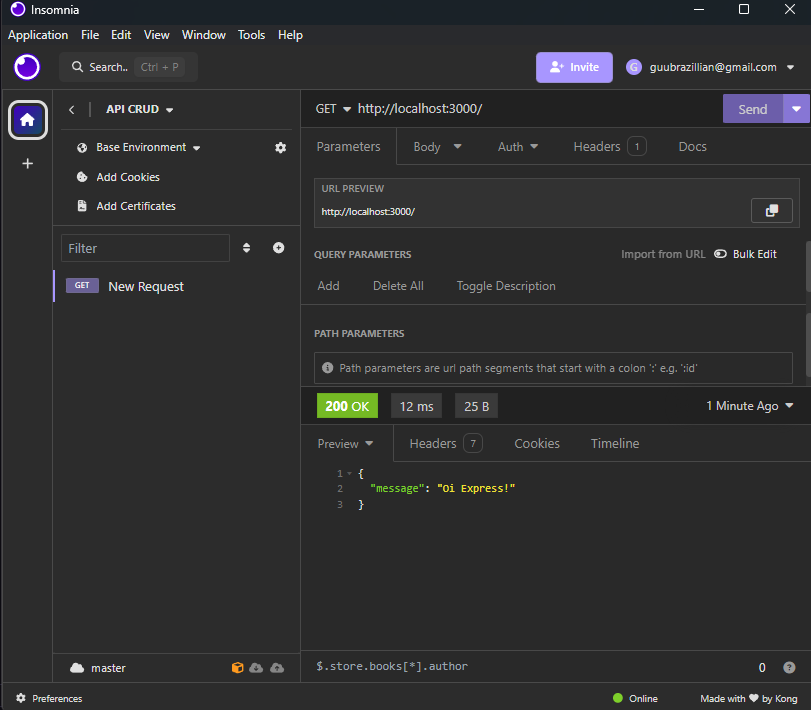

<h1>API RESTful CRUD</h1>

<h2>Fala time, tudo na paz de cristo ?  </h2>

<h4>Esta é uma API RESTful que implementa operações CRUD (Create, Read, Update, Delete).
</h4>

<h1>Afinal o que é uma API RESTful  CRUD?</h1>

Uma API RESTful CRUD é uma interface de programação de aplicações (API) que segue os princípios do estilo arquitetural REST (Representational State Transfer) e oferece operações CRUD (Create, Read, Update, Delete) para gerenciar recursos :) .

<h3>Instalação</h3>

Para instalar os pacotes necessários, execute:

npm install

Configuração
Configuração do Ambiente
Esta API utiliza variáveis de ambiente para configurar a conexão com o banco de dados. Crie um arquivo .env na raiz do projeto com o seguinte conteúdo:

DB_USER=seuUsuario
DB_PASSWORD=suaSenha

<h3>Testando a API</h3>

Para acompanhar e testar a API, recomendamos o uso do Insomnia.

Fiquem com Deus qualquer dúvida sobre a api me chama no linkedin.

https://www.linkedin.com/in/davibarreto-dev/

